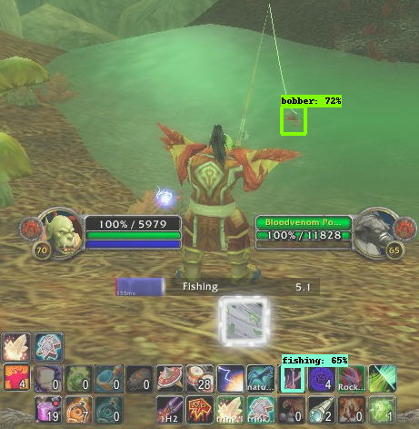
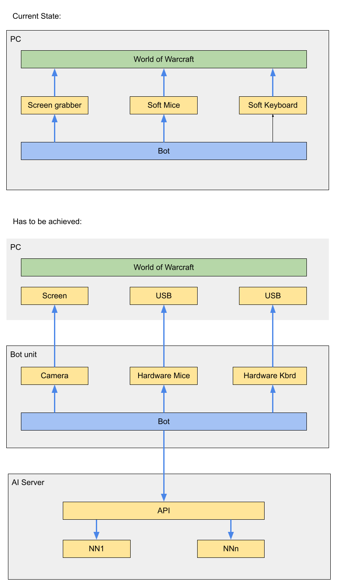

# AI-WordOfWarcraft-Bot
Yet another bot for WOW.
This one uses AI (Tensorflow) to do stuff.

At the moment it has only one NN and it supports only fishing.
Im planning to add more features such as:
1. Hardware devices support (Mice/Keyboard/Camera).
2. Moving (autopilot).
3. Positioning (on the map).
4. Mob grinding.
5. Farming.
6. Leveling.
7. BGs / Arenas.
8. Dungeons / raids.
9. Dungeons / raids farming.
10. Chat grabber (Resend everything to IM).
11. Chat AI.

Most of the things can be achieved with pixel programming, but i don't wanna look into it. The idea is to make a bot that will work without special addons, can be run on a different PC (PC/Server/Arduino/etc) and perform as a real player.

